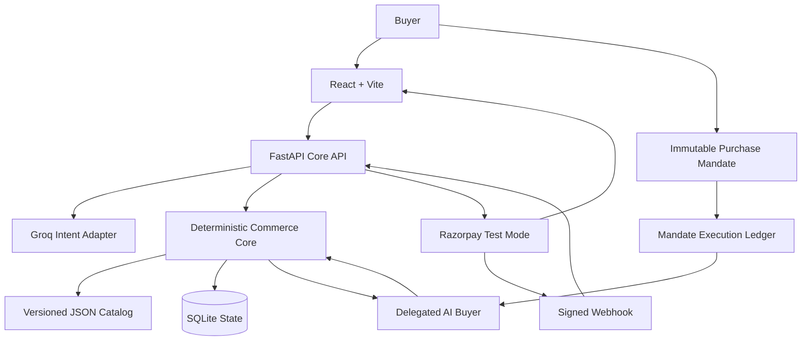
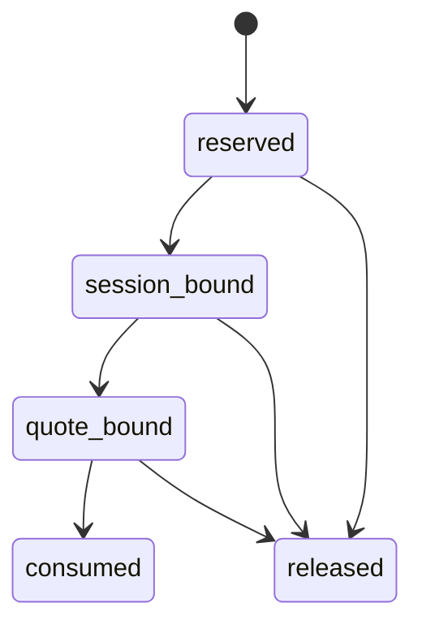
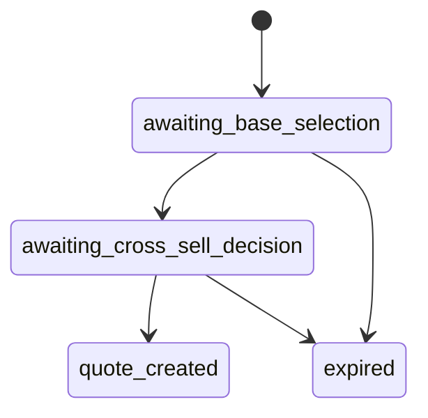
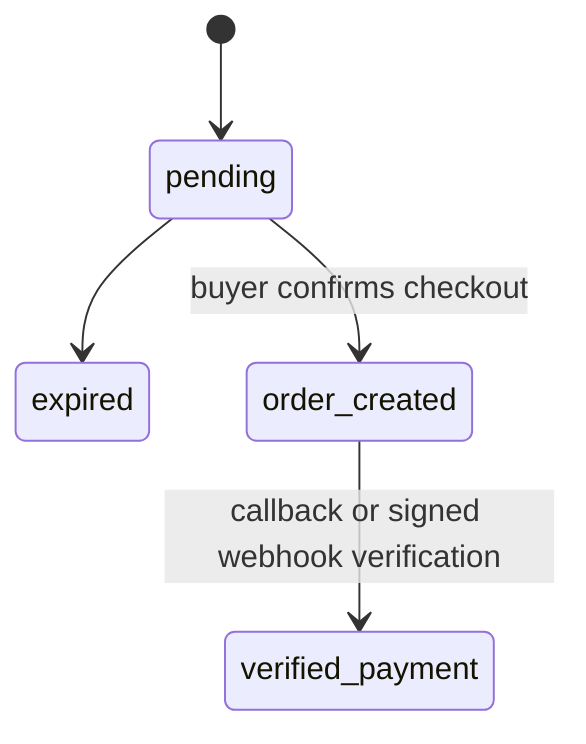

# CartPilot Architecture

This document describes CartPilot as it exists on `main`: a buyer-controlled, Razorpay Test Mode agentic-commerce system with two interaction modes:

1. a normal shopping assistant where the buyer chooses products, and
2. a delegated AI buyer that may choose products only inside an immutable buyer-approved purchase mandate.

## Architectural rule

> **AI may interpret and choose within bounded authority. Deterministic code controls commerce. The buyer still gates payment.**

The language model may:

- extract shopping intent in the normal flow,
- rank/select only from a deterministic eligible SKU set in delegated mode,
- explain its choice.

It may not:

- invent a SKU,
- set price or stock,
- modify a purchase mandate,
- bypass catalog or compatibility checks,
- create a Razorpay order without buyer confirmation,
- verify or declare payment success.

Structured output reduces malformed model responses, but safety comes from combining schema validation, a trusted catalog, deterministic eligibility rules, immutable mandates, append-only execution state, server-stored quotes, explicit buyer checkout confirmation, payment-provider signature verification, signed webhook recovery, and persistent audit events.

## System context



## Trust zones

| Zone | Trusted for | Not trusted for |
|---|---|---|
| Buyer input | Expressing intent, goals, explicit confirmations | SKU eligibility, price, stock, totals, payment status |
| Groq model output | Candidate structured intent or bounded delegated choice | Commerce authority, arbitrary SKUs, money values, payment truth |
| Purchase mandate | Buyer-approved immutable authority limits | Dynamic inventory or payment state |
| React frontend | Display and collection of buyer actions | Final price, order identity, payment verification |
| JSON catalog | Merchant-controlled SKU, price, stock flags, compatibility, cross-sell mappings | Distributed inventory reservation |
| FastAPI deterministic core | Eligibility, revalidation, state transitions, quotes, order payloads | Distributed transaction guarantees |
| SQLite | Local persisted sessions, quotes, mandates, execution ledger, payments, audit events | Multi-instance coordination |
| Razorpay | Test order creation and signed callback/webhook data | Payment truth until backend verification/reconciliation |

# Mode 1: Buyer-controlled shopping

## 1. Intent and base-product options

1. `POST /api/shop` accepts a buyer message.
2. `intent_extractor.py` calls Groq at temperature zero and requests strict structured output.
3. Missing essential details produce clarification; no quote/order/payment is created.
4. `request_builder.py` converts rupees to integer paise and forces checkout confirmation on.
5. `catalog.py` loads the trusted catalog.
6. `catalog_search.py` deterministically filters inactive, out-of-stock, over-budget, wrong-category, and incompatible products.
7. `recommender.py` returns bounded base-product options.
8. `shopping_session_store.py` persists the offered SKU set and catalog version.

## 2. Base selection and cross-sell

1. The buyer submits one offered base SKU.
2. The backend confirms the SKU belonged to the stored session offer.
3. Current catalog state, budget, stock, category, compatibility, and catalog version are revalidated.
4. Cross-sell candidates come only from merchant-controlled `cross_sell_skus` mappings.
5. The buyer accepts one offered companion or explicitly declines.

## 3. Quote

Before quote creation, selected products are revalidated again against the current trusted catalog. `quote_service.py` creates an immutable INR quote using integer paise. `quote_store.py` persists it idempotently and links it to the shopping session.

# Mode 2: Delegated AI buyer

The delegated flow changes one key responsibility: the AI may choose the product, but only from a deterministic eligible set and only under a buyer-approved mandate.

## 1. Purchase mandate

`POST /api/mandates` creates an immutable `PurchaseMandate` containing:

- `budget_paise`
- fixed `INR` currency
- `allowed_categories`
- `required_compatibility`
- `max_cross_sell_percentage`
- `checkout_confirmation_required = true`
- optional `buyer_goal`
- `created_at`
- `expires_at`

The mandate is stored as immutable JSON. There is no update path.

## 2. Mandate execution reservation

Before AI planning starts, CartPilot reserves the mandate in `mandate_execution_ledger.py`.

The ledger is append-only. The mandate itself remains unchanged.

Execution lifecycle:



A consumed mandate cannot be reserved again. Only one active execution may exist for a mandate. This prevents a reusable static budget from authorizing multiple concurrent purchases.

## 3. Deterministic filtering before AI planning

The delegated buyer does **not** receive the full catalog.

The backend first filters products using:

- mandate budget,
- allowed categories,
- required compatibility,
- product active state,
- product stock,
- trusted catalog data.

Only eligible product options are supplied to the AI planner.

Cross-sell candidates are also deterministically restricted before model selection.

## 4. AI purchase plan

`delegated_buyer.py` asks Groq for strict structured output matching `DelegatedBuyerPlan`, containing:

- base product SKU,
- optional cross-sell SKU,
- short reason,
- confidence score.

The model is instructed to choose only from the supplied eligible SKU set.

Even after structured output, CartPilot verifies that:

- selected base SKU is in the eligible set,
- selected cross-sell belongs to the allowed list for that base product,
- both products still satisfy the mandate,
- prices still come from the trusted catalog.

The AI cannot convert a fabricated SKU or price into authority.

## 5. Session and quote binding

Once a safe plan exists:

1. a normal shopping session is created,
2. the mandate execution is bound to that session,
3. the AI-selected base product is recorded,
4. an immutable quote is created,
5. the quote is bound to the mandate execution ledger.

The delegated flow stops at:

```text
purchase_ready_for_confirmation
```

No Razorpay order exists yet.

## 6. Delegated checkout confirmation

`POST /api/delegated-checkout/confirm` requires explicit buyer confirmation.

Only then does CartPilot:

1. call the existing checkout service,
2. create or reuse the Razorpay order,
3. consume the mandate execution authority.

If the quote has expired, the execution may be safely released. Once consumed, it cannot be reused.

# Checkout and payment verification

## Browser callback path

1. The buyer explicitly confirms checkout.
2. `checkout_service.py` requires a pending, unexpired, linked quote.
3. Razorpay order amount, currency, receipt, and notes are built from the server-stored quote.
4. Returned order fields are checked before persistence.
5. React opens Razorpay Checkout with the server-created order.
6. `POST /api/payment/verify` compares the submitted order ID with server state and verifies the signature using Razorpay's utility.
7. Only a verified result is persisted as a payment.

The browser success callback is therefore an input to verification, not proof of payment.

# Webhook recovery

CartPilot also supports signed Razorpay webhook reconciliation for lost browser callbacks.

`POST /api/payment/webhook`:

1. validates body size,
2. verifies the HMAC webhook signature using the configured webhook secret,
3. validates the Razorpay event ID,
4. hashes and persists webhook payload identity,
5. rejects replay/conflicting reuse of an event ID,
6. accepts only known CartPilot orders,
7. verifies captured payment status,
8. verifies amount and currency against the immutable quote,
9. stores/reuses the verified payment,
10. records `payment_reconciled` in the audit ledger.

This allows payment recovery even when the browser callback is unavailable.

# Read-only payment polling

`GET /api/payment/status/{quote_id}` returns one of:

- `checkout_not_started`
- `confirmation_pending`
- `verified`
- `expired`

The frontend can poll this endpoint after Razorpay checkout to detect a webhook-recovered payment without trusting browser state.

# Commerce Flight Recorder audit ledger

CartPilot stores persistent audit events for important buyer, AI, deterministic-core, and Razorpay actions.

Examples include:

- mandate created/accepted/rejected/expired,
- intent extracted,
- catalog searched,
- product offered,
- base product selected,
- cross-sell evaluated/decided,
- quote created/expired,
- checkout confirmed,
- order creation requested/created,
- payment verification requested,
- payment verified/rejected,
- payment reconciled by webhook.

Audit events may be scoped to a shopping session, purchase mandate, quote, or payment-provider identifiers. The frontend can render buyer-visible timelines from persisted events.

# State machines

## Shopping session



Delegated mode reuses this state machine; the difference is that the AI selects from the deterministic offered set instead of waiting for the human base-product click.

## Quote and payment



# Persisted data

SQLite defaults to `backend/data/cartpilot.db`; `CARTPILOT_DB_PATH` can override it.

Important persisted state includes:

| Store / table | Purpose |
|---|---|
| `shopping_sessions` | Offered SKUs, selected base, session status, quote link |
| `quotes` | Immutable quote terms and Razorpay order state |
| `payments` | Verified payment identity and verification source |
| `purchase_mandates` | Immutable buyer-approved purchase authority |
| `mandate_execution_events` | Append-only reservation/binding/consumption history |
| audit-event storage | Persistent commerce flight-recorder history |
| webhook-event storage | Webhook replay/conflict protection |

The trusted catalog remains `backend/data/products.json`.

# Module responsibilities

| File | Responsibility |
|---|---|
| `models.py` | Pydantic contracts and invariants |
| `catalog.py` | Load and validate trusted catalog |
| `catalog_search.py` | Deterministic eligibility filtering and scoring |
| `recommender.py` | Bounded base and cross-sell recommendations |
| `request_builder.py` | Convert validated intent into internal request |
| `intent_extractor.py` | Groq structured intent adapter |
| `commerce_agent.py` | Orchestrate normal shopping flow |
| `purchase_mandate_store.py` | Persist immutable mandates |
| `purchase_mandate_service.py` | Create and authorize products under mandates |
| `mandate_execution_ledger.py` | Reserve/bind/consume/release delegated authority |
| `delegated_buyer.py` | Safe AI planning over deterministic eligible SKUs |
| `delegated_api.py` | Delegated and restricted external-agent endpoints |
| `shopping_session_store.py` | Persist guarded session transitions |
| `selection_service.py` | Revalidate selections and create normal-flow quotes |
| `quote_service.py` | Build immutable quotes from trusted catalog terms |
| `quote_store.py` | Persist quotes, order IDs, and verified payments |
| `checkout_service.py` | Buyer-confirmed Razorpay order creation |
| `payment_service.py` | Verify browser callback signatures |
| `payment_webhook.py` | Signed webhook recovery and reconciliation |
| `payment_status.py` | Read-only payment recovery state |
| `audit_events.py` | Persistent Commerce Flight Recorder events |
| `main.py` | Core FastAPI routes |
| `main_delegated.py` | Core API plus delegated-commerce router |

# Important invariants

- Currency is fixed to INR.
- All internal money values use integer paise.
- Checkout confirmation cannot be disabled.
- Only active, in-stock trusted catalog SKUs may be offered or quoted.
- A normal-flow selected base SKU must belong to the session's stored offer set.
- A delegated AI-selected SKU must belong to the deterministic eligible set supplied to the model.
- Cross-sells must come from merchant-approved mappings and satisfy compatibility/budget limits.
- The AI cannot change mandate fields, catalog price, stock, quote values, or payment status.
- Only one active execution may use a purchase mandate.
- A consumed mandate cannot be reused.
- A mandate-bound live quote retains authority so the same mandate cannot create another active quote.
- A quote must be linked to a shopping session before checkout.
- Razorpay order amount comes from the immutable stored quote.
- A browser payment is persisted only after signature verification.
- A webhook payment is accepted only after signature, order, amount, currency, and captured-state validation.
- Webhook event IDs cannot safely be replayed with different content.
- Repeated compatible operations are idempotent; conflicting retries are rejected.

# External-agent boundary

The restricted external-agent HTTP surface exposes high-level delegated capabilities such as:

- create a mandate-bound purchase plan,
- read execution state,
- read existing mandate/audit information through the core APIs.

It deliberately does not expose:

- mandate mutation,
- catalog price mutation,
- unrestricted Razorpay order creation,
- payment verification/forging authority.

The current implementation is an HTTP capability boundary, not yet a dedicated MCP server.

# Failure behavior

| Condition | Result |
|---|---|
| Groq unavailable | `503`; no unsafe commerce authority granted |
| Invalid request/decision shape | `422` |
| Missing session, quote, mandate, or execution | `404` |
| Expired session/quote/mandate execution | `410` where applicable |
| Catalog changed, invalid state transition, mandate already reserved/consumed | `409` |
| Razorpay order creation inconsistent/fails | `502` |
| Browser payment signature invalid | `400`; payment not stored |
| Webhook signature malformed/invalid | `400` |
| Webhook conflicts with stored state | `409` |
| Webhook secret missing | `503` |

# Testing and evidence

The backend suite covers the original commerce core plus purchase mandates, audit events, payment recovery, delegated execution, and bounded AI buyer behavior. External Groq and Razorpay boundaries are mocked in automated tests.

Current project evidence:

- the full backend suite passed in GitHub Actions after delegated-buyer integration,
- the delegated purchase flow was manually tested,
- frontend ESLint and production Vite build passed during the commerce-audit/payment-recovery phase,
- Razorpay webhook recovery is implemented and automated-test verified,
- final production-style webhook recovery testing remains a deployment-stage check.

The workflow currently triggers automatically for `feature/buyer-purchase-mandate` and can also be launched manually via `workflow_dispatch`.

# Production gaps

CartPilot should not be presented as production-ready. Before real commerce use, it needs at least:

1. authentication, authorization, and resource ownership checks,
2. production secret management and environment enforcement,
3. production database migrations and multi-worker coordination,
4. durable idempotency around process crashes and remote order creation,
5. transactional inventory reservation/decrement/reconciliation,
6. full refund, dispute, cancellation, and webhook-event lifecycle handling,
7. HTTPS, hardened CORS, rate limiting, threat review, and monitoring,
8. stronger frontend session restoration and end-to-end browser testing,
9. deployed webhook-recovery validation,
10. a hardened external-agent authentication/authorization model before exposing delegated capabilities publicly.

These gaps define the distance between a strong buildathon/Test Mode prototype and a production commerce platform.
