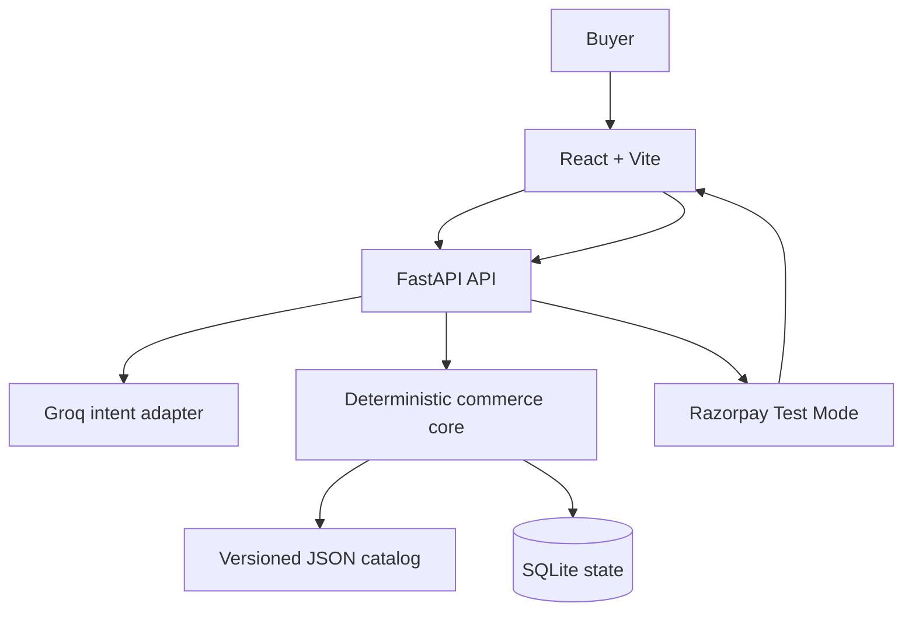
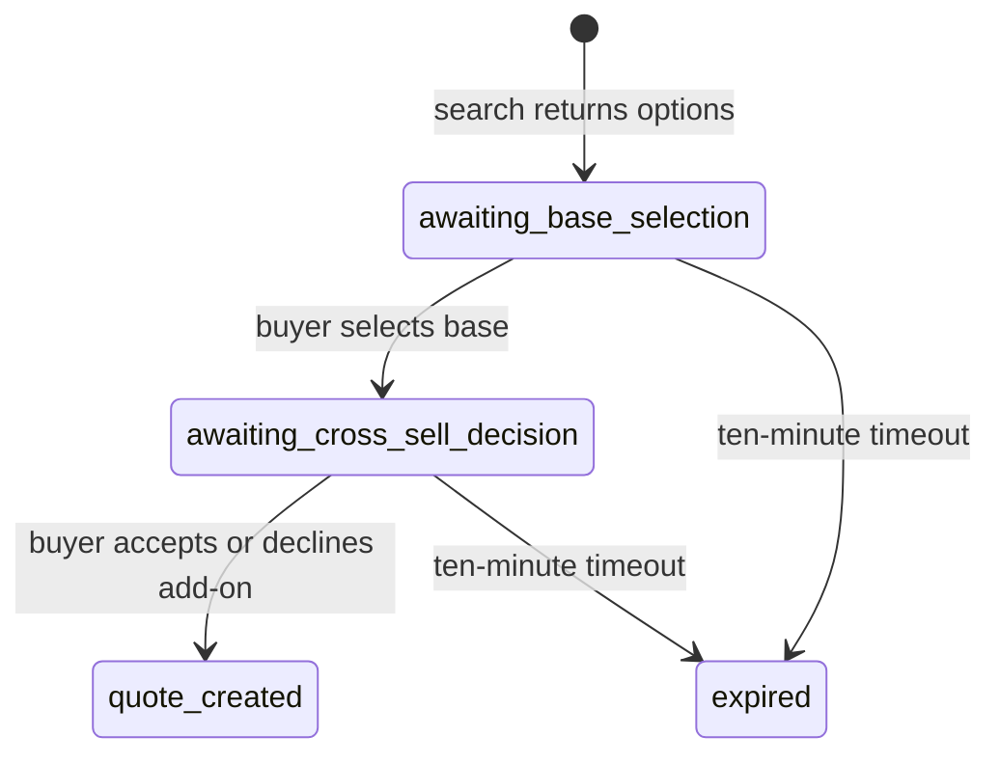
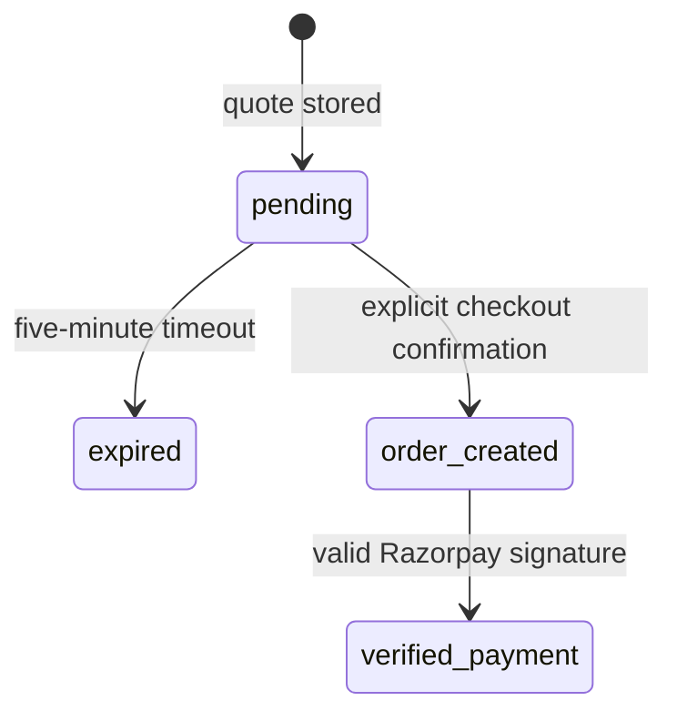

# CartPilot Architecture

This document describes CartPilot as it exists on `main`: a local, single-process, Razorpay Test Mode demonstration of buyer-controlled agentic commerce for VoltCart.

## Architectural rule

> **AI understands language. Deterministic code controls commerce. The buyer explicitly gates every money-related transition.**

The language model may extract a query, budget, category, and compatibility requirements. It does not receive authority to choose a SKU, set a price, declare stock, create a quote, create an order, or verify a payment.

Structured output reduces malformed model responses, but it does not make model interpretation infallible. The safety design therefore combines schema validation, a trusted catalog, deterministic eligibility rules, buyer-visible choices, explicit decisions, server-stored state, and payment-provider signature verification.

## System context

### Trust zones

| Zone | Trusted for | Not trusted for |
|---|---|---|
| Buyer input | Expressing intent and explicit choices | SKU eligibility, price, stock, totals, payment status |
| Groq model output | Candidate intent after Pydantic validation | Commerce authority or money values |
| React frontend | Display and collection of buyer actions | Final prices, order identity, or payment verification |
| JSON catalog | Merchant-controlled SKUs, prices, stock flags, compatibility, companion mappings | Real-time inventory reservation |
| FastAPI deterministic core | Eligibility, revalidation, state transitions, quotes, order payloads | Distributed transaction guarantees |
| SQLite | Local persisted session, quote, order, and verified-payment state | Multi-instance coordination |
| Razorpay | Test order and Checkout response | Proof of payment until the backend verifies the signature |

## End-to-end flow

### 1. Intent and base-product options

1. `POST /api/shop` accepts a 3–500 character buyer message.
2. `intent_extractor.py` calls Groq at temperature zero and requests strict JSON-schema output matching `ExtractedShoppingIntent`.
3. Missing budget or essential compatibility information produces `clarification_required`; no catalog session, quote, order, or payment is created.
4. `request_builder.py` converts whole rupees to integer paise and forces checkout confirmation on.
5. `catalog.py` loads and validates the trusted catalog.
6. `catalog_search.py` filters inactive, out-of-stock, over-budget, wrong-category, and incompatible products. It scores text matches deterministically and sorts ties by lower price and SKU.
7. `recommender.py` returns at most three base-product options. The first is labeled as the best match, but the buyer must choose.
8. `shopping_session_store.py` persists a ten-minute session containing the catalog version and offered SKU set.

Text relevance weights are deterministic:

| Match location | Points per matching token |
|---|---:|
| Product name | 5 |
| Product tags | 4 |
| Category | 3 |
| Compatibility tags | 2 |
| Description | 1 |

### 2. Base selection and optional cross-sell

1. `POST /api/shop/select-base` accepts a session ID and one SKU.
2. The backend requires that the SKU was in the stored offer, the session is live, and the catalog version has not changed.
3. It reruns current deterministic eligibility checks for price, stock, budget, category, and compatibility.
4. Cross-sell candidates come only from the selected base product’s trusted `cross_sell_skus` list.
5. Base-category restrictions are not applied to companions, allowing combinations such as charger → cable.
6. A companion must be active, in stock, compatible, within the remaining total budget, and priced at no more than 20% of the original buyer budget.
7. At most two eligible companions are returned, ordered by price and then SKU. Nothing is preselected.

### 3. Cross-sell decision and quote

`POST /api/shop/select-cross-sell` requires exactly one of these decisions:

- `accept` with the SKU of an actually offered companion; or
- `decline` with no companion SKU.

Before quote creation, the backend revalidates the selected products against the current trusted catalog. `quote_service.py` then creates an immutable, five-minute INR quote whose amounts are all integer paise.

For a session-backed quote, the quote ID reuses the random 32-hex-character portion of the session ID. This gives one deterministic quote identity per shopping session. `quote_store.py` makes same-terms retries idempotent and rejects a conflicting quote with the same identity. The quote is then linked back to that exact completed shopping session.

`catalog_version` records which catalog snapshot produced the offer. A version change before selection or quote creation forces a new search. After creation, checkout uses the prices stored in the quote rather than silently substituting current catalog prices.

### 4. Checkout and payment verification

1. The UI displays the stored quote; no order exists yet.
2. `POST /api/checkout/confirm` requires `confirmed: true` and a valid quote ID.
3. `checkout_service.py` requires the quote to be pending, unexpired, and linked to a `quote_created` shopping session.
4. The Razorpay order amount, currency, receipt, and notes are built from the server-stored quote—not from frontend prices.
5. The returned Razorpay order is checked for expected ID format, amount, currency, receipt, and `created` status before its ID is persisted.
6. A repeat confirmation in the same stored state returns the existing Razorpay order.
7. React loads Razorpay Checkout and supplies the public key ID plus the server-created order.
8. `POST /api/payment/verify` compares the submitted order ID with the server-stored order, invokes Razorpay’s signature verification utility, and stores a payment only when verification returns true.
9. A repeat verification for the same payment is idempotent; a conflicting payment for the same quote is rejected.

The Checkout success callback is therefore an input to verification, not proof of payment.

## State machines

### Shopping session

Conditional SQL updates require the expected previous state, which prevents a stale operation from silently overwriting a competing transition in the same database.

### Quote and payment

The verified payment is stored in a separate `payments` table. The quote itself remains in `order_created` state after verification.

## Persisted data

SQLite defaults to `backend/data/cartpilot.db`; `CARTPILOT_DB_PATH` can override it. Tables are created lazily on first use.

| Table | Important fields | Key constraints |
|---|---|---|
| `shopping_sessions` | serialized request and SKU offers, status, quote link, timestamps | session ID primary key; quote ID unique and foreign-keyed |
| `quotes` | immutable quote JSON, status, Razorpay order ID, timestamps | quote ID primary key; Razorpay order ID unique |
| `payments` | quote ID, order ID, payment ID, verified timestamp | each quote, order, and payment ID is unique |

The demo catalog is not stored in SQLite. `backend/data/products.json` is merchant-controlled source data with catalog version `2.0.0`, 33 products, eight categories, and deliberate inactive and out-of-stock edge cases.

## Module responsibilities

| File | Responsibility |
|---|---|
| `models.py` | Pydantic contracts and cross-field invariants |
| `catalog.py` | Load, validate, normalize, and index trusted catalog data |
| `catalog_search.py` | Deterministic eligibility filtering and relevance scoring |
| `recommender.py` | Bounded base options and approved cross-sell options |
| `request_builder.py` | Convert validated intent into a bounded internal request |
| `config.py` | Read secrets and model configuration from environment variables |
| `intent_extractor.py` | Isolated Groq adapter with strict structured output |
| `commerce_agent.py` | Orchestrate intent, search, and initial session creation |
| `database.py` | SQLite path selection and commit/rollback connection boundary |
| `shopping_session_store.py` | Persist session state and guarded transitions |
| `selection_service.py` | Revalidate buyer selections, offer companions, and finalize quote decisions |
| `quote_service.py` | Validate trusted product terms and build immutable quotes |
| `quote_store.py` | Persist quotes, Razorpay order IDs, and verified payments idempotently |
| `checkout_service.py` | Gate confirmation and create a Razorpay order from stored terms |
| `payment_service.py` | Verify Razorpay signatures before recording payments |
| `main.py` | HTTP schemas, routes, CORS, and safe error mapping |
| `frontend/src/api.js` | Typed-by-convention HTTP boundary for all backend actions |
| `frontend/src/razorpay.js` | Load Checkout once and resolve its success response |
| `frontend/src/App.jsx` | Render the buyer-controlled workflow and hold local UI state |

## Important invariants

- Currency is fixed to INR.
- All internal money is positive integer paise; the UI alone formats rupees.
- A shopping request cannot disable checkout confirmation.
- Only active, in-stock catalog SKUs can be offered or quoted.
- A selected base SKU must be one of that session’s stored offers.
- An accepted cross-sell SKU must be one of that session’s stored companion offers and one of the base product’s merchant-approved mappings.
- Base plus cross-sell cannot exceed the original total budget.
- The cross-sell price cannot exceed 20% of the original budget.
- A quote must equal the sum of its stored component prices and must have timezone-aware timestamps.
- Checkout cannot use an orphan quote; the quote must be linked to the completed shopping session.
- The frontend cannot override the amount sent to Razorpay.
- A payment is persisted only after its order ID matches server state and Razorpay verifies the signature.
- Repeating the same finalized decision, checkout confirmation, or payment verification is idempotent; conflicting retries are rejected.

## Failure behavior

| Condition | Result |
|---|---|
| Groq unavailable | `503`; no session or money action |
| Invalid request or decision shape | `422` |
| Missing session or quote | `404` |
| Expired session or quote | `410` |
| Catalog changed, SKU no longer eligible, or invalid state transition | `409` |
| Razorpay order creation fails or returns inconsistent data | `502`; order is not marked created |
| Payment signature is invalid | `400`; payment is not stored |

## What is deliberately not delegated to the LLM

The LLM cannot call commerce functions. It produces only `ExtractedShoppingIntent`, which has enumerated categories and compatibility tags plus validation rules. Catalog loading, text scoring, tie-breaking, allowed SKU sets, cross-sell mappings, price arithmetic, expiry, state transitions, order creation, and signature verification remain ordinary Python operations.

This boundary is more important than the choice of model provider. Replacing Groq should require changing the intent adapter, not the commerce invariants.

## Testing strategy and evidence

The backend suite covers models, catalog validation, deterministic search, recommendation scenarios, session transitions, quote construction and persistence, selection services and APIs, checkout, payment verification, and endpoint error mapping. External Groq and Razorpay calls are patched at their boundaries.

Current locally reported evidence for `main`:

- 109 backend tests passing.
- Frontend production build passing.
- One complete Razorpay Test Mode checkout manually completed with backend verification.

This evidence is local: there is no CI workflow, no published coverage measurement, and no recorded clean-machine setup timing yet. `pytest.ini` also points to `backend/tests` while the suite currently lives in `backend/test`, so the explicit command `python -m pytest backend/test -q` is the reliable test entry point.

## Production gaps

CartPilot should not be presented as production-ready. Before real commerce use, it needs at least:

1. Authentication, authorization, and ownership checks for sessions and quotes.
2. A startup guard that rejects Razorpay live keys outside an explicitly approved production configuration.
3. A database-backed idempotency design or distributed lock for multiple API workers.
4. Recovery for a process crash after Razorpay creates an order but before the local transaction stores its ID.
5. Inventory reservation, decrement, and reconciliation; current stock is only checked.
6. Razorpay webhooks, replay protection, event reconciliation, refunds, and operational audit tooling.
7. A production database and migration system instead of lazy SQLite table creation.
8. HTTPS, hardened CORS, CSRF/threat review, secret management, rate limiting, monitoring, and structured logs.
9. Session recovery in the frontend and accessible end-to-end browser tests.
10. CI with pinned/managed dependencies, coverage reporting, and clean-environment startup measurement.

These gaps do not invalidate the demo’s core safety boundary; they define the difference between a working Test Mode prototype and a production commerce platform.
